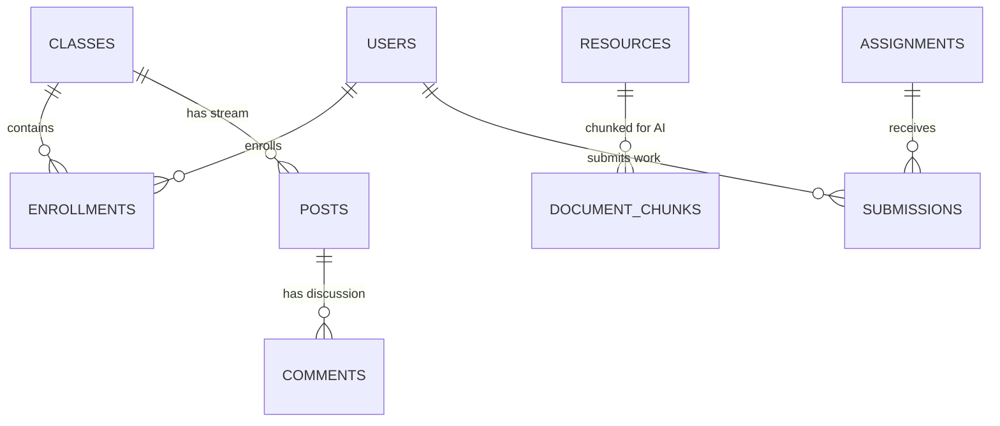

# EduSphere Classroom: Project Documentation

## 1. Project Overview
**EduSphere Classroom** is a next-generation Learning Management System (LMS) designed to bridge the gap between teachers, students, and parents. Unlike traditional platforms, EduSphere integrates advanced AI (Gemini) to provide personalized learning paths, automated content generation, and emotional intelligence tracking.

---

## 2. Core Features & Working

### A. Classroom Ecosystem
- **Multi-Role System**: 
  - **Teachers**: Manage classes, create assignments, grade work, and monitor student wellbeing.
  - **Students**: Join classes, submit assignments, interact with the AI assistant, and track their personalized learning path.
  - **Parents**: Monitor their children's performance, grades, and engagement via a dedicated dashboard.
  - **Super Admins**: System-wide control over users, classes, and site-wide activity.
- **Class Implementation**: Classes are identified by unique `class_code` identifiers. Teachers generate codes, and students enroll by entering them.

### B. Intelligent Classroom Companion (AI)
- **Edu AI Bot**: A RAG (Retrieval-Augmented Generation) assistant that answers student questions based on actual class materials (Syllabus, Resources).
- **Automated Grading & Feedback**: AI analyzes student submissions and provides initial sentiment-based feedback.
- **Content Generation**: Teachers can generate quizzes, summaries, and lesson plans directly from uploaded PDFs or text.

### C. Communication & Engagement
- **The Stream**: A real-time feed for announcements, discussions, and polls.
- **Live Messaging**: Socket.io-powered direct and group messaging with real-time "seen" status.
- **Engagement Heatmaps**: Teachers can see when and how students are interacting with the course materials.

### D. Emotional Intelligence (Phases 4-5)
- **Wellbeing Check-ins**: Students submit daily "mood" check-ins.
- **AI Sentiment Analysis**: The system flags students whose notes or comments reflect high stress or negativity, notifying the teacher instantly.

---

## 3. Technology Stack

### Frontend
- **React 18** + **Vite**: Ultra-fast build and runtime performance.
- **TanStack Query (v5)**: Handles all server state, caching, and background synchronization.
- **Wouter**: A minimal, path-based router.
- **Shadcn UI + Tailwind CSS**: A beautiful, accessible component library with a "Glassmorphic" premium design.
- **Three.js**: Used for immersive 3D backgrounds ([Scene3D.tsx](file:///c:/Users/Nishant/Desktop/EduSphere-Classroom/EduSphere-Classroom/EduSphere-Classroom/client/src/components/Scene3D.tsx)).

### Backend
- **Node.js (Express)**: Modern ESM-based server architecture.
- **Passport.js**: Robust authentication supporting Local (Email/Pass) and OAuth (Google/GitHub).
- **Drizzle ORM**: Type-safe database interactions with TypeScript.
- **Socket.io**: Persistent bidirectional communication for chat and notifications.

### Cloud & Third-Party
- **Neon (PostgreSQL)**: Serverless database with branching support.
- **AWS S3**: Cloud storage for student submissions and teacher resources.
- **Google Gemini API**: Powers the RAG bot, sentiment analysis, and content generation.
- **Resend**: Transactional email service for parent invitations and grade notifications.
- **Upstash (Redis)**: Managed Redis for rate limiting and background queues.

---

## 4. Codebase Structure

```bash
├── client/                 # Frontend React Application
│   ├── src/
│   │   ├── components/     # UI Components (Buttons, Modals, AI Widgets)
│   │   ├── hooks/          # Custom Hooks (auth, api-state)
│   │   ├── lib/            # Utility functions (queryClient)
│   │   └── pages/          # Full page views (Dashboard, ClassView, Auth)
│   └── index.html
├── server/                 # Backend Node.js Application
│   ├── services/           # Core Logic (AI, Files, Email, Risk Scoring)
│   ├── auth.ts             # Passport.js session & strategy setup
│   ├── routes.ts           # REST API Route definitions (~900 lines)
│   ├── storage.ts          # Database Interface (Logic abstraction)
│   ├── socket.ts           # Socket.io event handling
│   └── index.ts            # Entry point
├── shared/                 # Code shared between frontend & backend
│   ├── schema.ts           # Drizzle schema & Zod validation types
│   └── routes.ts           # Shared API route definitions
└── drizzle/                # Migration files and DB configuration
```

---

## 5. Database Schema (Drizzle ORM)

### Key Relationships
- **Users**: Central table for all roles. Auth via `password_hash` or `provider_id` (OAuth).
- **Enrollments**: Linking table between `users` (students) and `classes`.
- **Resources & Document Chunks**: Documents are uploaded, then split into `document_chunks` with `embedding` vectors for AI retrieval.
- **Student Risk**: Aggregated data from attendance, grades, and sentiment to identify at-risk learners.



---

## 6. Connectivity & Data Flow

### Authentication Flow
1. User logs in via Local/Google/GitHub.
2. Passport.js serializes session to Redis/Memory.
3. Protected routes on frontend use `useAuth` hook to verify state before rendering.

### AI RAG (Bot) Flow
1. Student asks a question in [BotChatWidget.tsx](file:///c:/Users/Nishant/Desktop/EduSphere-Classroom/EduSphere-Classroom/EduSphere-Classroom/client/src/components/BotChatWidget.tsx).
2. Backend generates a vector embedding for the question.
3. Backend searches `document_chunks` using cosine similarity.
4. Top 3 context chunks + conversation history + question are sent to Gemini.
5. Gemini response is streamed back to the student.

---

## 7. Setup & Development

### Prerequisites
- Node.js 20+
- PostgreSQL (Neon recommended)
- Redis (Upstash recommended)

### Environment Variables (.env)
```env
DATABASE_URL=postgresql://...
GOOGLE_GEMINI_API_KEY=...
AWS_ACCESS_KEY_ID=... # Optional (falls back to local)
AWS_SECRET_ACCESS_KEY=...
RESEND_API_KEY=...
NEXTAUTH_SECRET=...
```

### Installation
```bash
# Install dependencies
npm install

# Push database schema
npm run db:push

# Start development server
npm run dev
```

---

## 8. Deployment Strategy
- **Frontend**: Built with Vite and served as static assets or via the Express server in production.
- **Backend**: Deployed as a Node.js process (PM2 recommended) or via AWS EC2 using the provided [deploy-ec2.sh](file:///c:/Users/Nishant/Desktop/EduSphere-Classroom/EduSphere-Classroom/EduSphere-Classroom/deploy-ec2.sh).
- **File Ingestion**: Use `/api/upload` for server-side processing or `/api/upload/presign` for direct-to-S3 client uploads.
